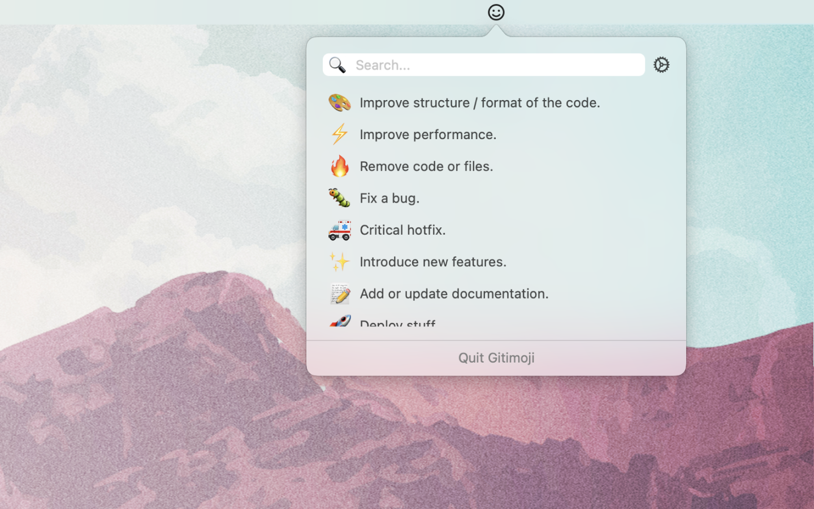

# Gitimoji - Gitmoji for MacOS 

## About

This project provides an application for using [Gitmoji](https://github.com/carloscuesta/gitmoji) on your Mac. Gitimoji lives in your Menubar and provides a searchable list of all the Gitmojis with their description.

## Installation

WIP

## License

The code is available under the [MIT](https://github.com/TimoZacherl/gitimoji/blob/master/LICENSE) license.
