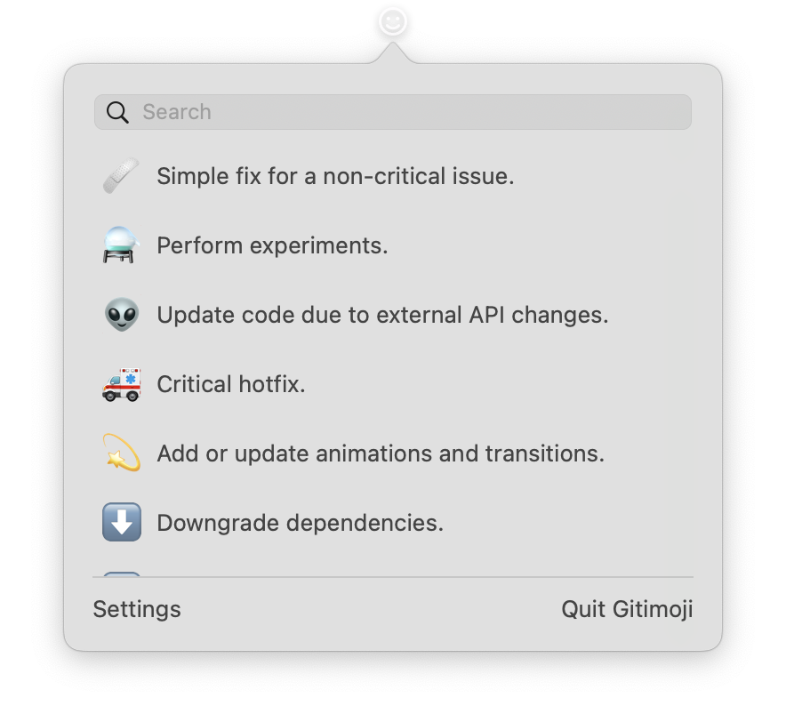

# Gitimoji - Gitmoji for MacOS

## About

This project provides an application for using [Gitmoji](https://github.com/carloscuesta/gitmoji) on your Mac. Gitimoji lives in your Menubar and provides a searchable list of all the Gitmojis with their description.

## Installation

You can find the latest stable Version of the App inside the [releases](https://github.com/lovetodream/gitimoji/releases/latest) tab.
The attached binary on every release is signed and notarized by Apple. You can download it and move it inside your Applications folder. That's it! 🎉

## License

The code is available under the [MIT](https://github.com/lovetodream/gitimoji/blob/master/LICENSE) license.
